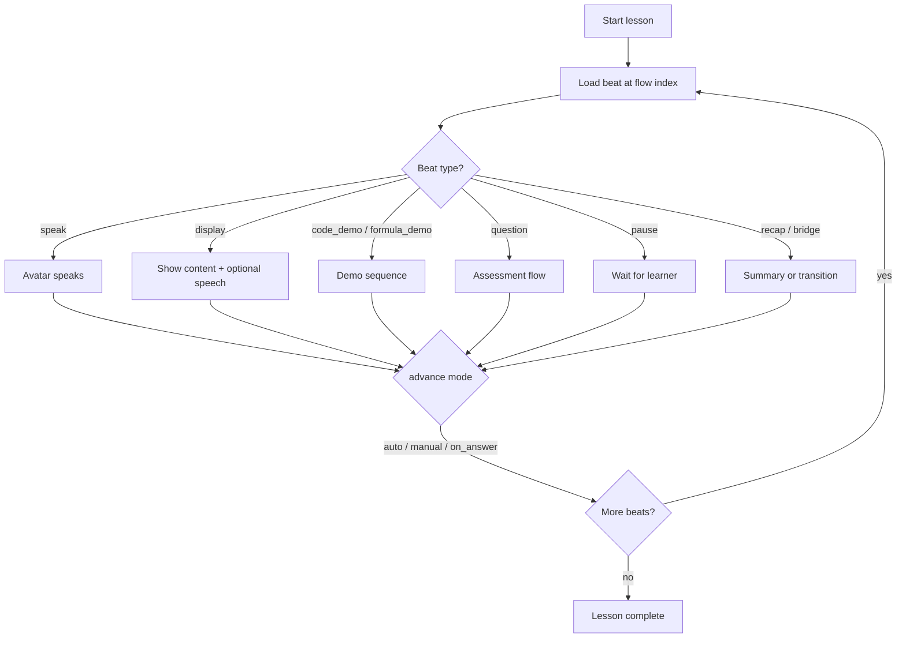

# Curriculum v2 Guide — Flow-Based Lessons

This document describes the **v2 curriculum format** (`schema_version: 2`), how the AI instructor avatar speaks and progresses through a lesson, and how the learning experience is structured.

For a full working example, see [`CURRICULUM_V2_SAMPLE.json`](./CURRICULUM_V2_SAMPLE.json).

For the legacy v1 format, see [`CURRICULUM_JSON_GUIDE.md`](./CURRICULUM_JSON_GUIDE.md).

---

## Table of contents

1. [Why v2 exists](#why-v2-exists)
2. [High-level structure](#high-level-structure)
3. [The learning flow model](#the-learning-flow-model)
4. [Beat types reference](#beat-types-reference)
5. [Avatar and speech progression](#avatar-and-speech-progression)
6. [Advance modes (pacing)](#advance-modes-pacing)
7. [Question beats and feedback](#question-beats-and-feedback)
8. [Code and formula demos](#code-and-formula-demos)
9. [Progress and navigation](#progress-and-navigation)
10. [Defaults and templates](#defaults-and-templates)
11. [Authoring tips](#authoring-tips)
12. [Migrating from v1](#migrating-from-v1)

---

## Why v2 exists

In **v1**, a lesson is a fixed bag of fields (`body`, `avatar_script`, `code_example`, `questions[]`). The app decides the order — intro, then body, then script, then demo, then all questions at the end.

In **v2**, a lesson is an ordered **`flow`** of **beats**. Each beat is one moment in the lesson: something the avatar says, something on screen, or something the learner does. Authors control the teaching rhythm directly.

This matches how a real teacher runs a class:

```
Hook → Explain → Check → Demo → Pause → Practise → Recap → Bridge to next lesson
```

---

## High-level structure

```
Curriculum (root)
├── slug                    → unique course ID
├── schema_version: 2       → identifies v2 format
└── curriculum
    ├── title, description, category, age, class, ...
    ├── defaults            → optional global avatar phrases and pacing
    └── modules[]
        ├── id, title
        ├── unlock          → optional gating (replaces unused v1 prerequisite)
        └── lessons[]
            ├── id, title, goal, estimated_minutes
            └── flow[]     → ordered list of beats (the lesson script)
```

### Lesson IDs

Use **globally unique** lesson IDs to avoid collisions across modules:

```
module_01__lesson_01
module_02__lesson_01
```

---

## The learning flow model

A lesson is not “read these properties in order.” It is a **script** the runtime plays beat by beat.



### Phases (optional metadata)

Tag beats with `phase` for progress UI and authoring — not required for runtime:

| Phase     | Purpose                          |
|-----------|----------------------------------|
| `hook`    | Grab attention, connect to learner |
| `teach`   | Explain concepts, show examples  |
| `assess`  | Quick knowledge checks           |
| `practice`| Hands-on exercises               |
| `reflect` | Recap and bridge to next lesson  |

---

## Beat types reference

### `speak`

Avatar narration only. No extra panel unless subtitles are shown.

```json
{
  "id": "hook",
  "type": "speak",
  "phase": "hook",
  "avatar": {
    "text": "Hey! Ready to learn something new today?"
  },
  "advance": "auto"
}
```

---

### `display`

On-screen reading content. Avatar may speak alongside (`timing: "with_display"`) or stay silent.

```json
{
  "id": "concept",
  "type": "display",
  "phase": "teach",
  "title": "What is a variable?",
  "body": "A **variable** stores data under a name.",
  "avatar": {
    "text": "Think of it like a labeled box.",
    "timing": "with_display"
  },
  "advance": "manual"
}
```

---

### `media`

Show an image or video.

```json
{
  "id": "diagram",
  "type": "media",
  "phase": "teach",
  "media": {
    "image": "https://example.com/chart.png",
    "alt": "Order of operations chart"
  },
  "avatar": {
    "text": "Here's a visual to help you remember."
  },
  "advance": "manual"
}
```

---

### `code_demo`

Instructor types and optionally runs a coding example. Used in **coding** courses.

```json
{
  "id": "demo",
  "type": "code_demo",
  "phase": "teach",
  "code_example": {
    "code": "console.log('Hello');",
    "language": "javascript",
    "description": "Watch this line appear.",
    "explanation": "console.log prints text to the output.",
    "autoRun": true,
    "typingSpeed": 60
  },
  "advance": "auto"
}
```

---

### `formula_demo`

Instructor types a worked math example. Used in **mathematics** courses.

```json
{
  "id": "formula_demo",
  "type": "formula_demo",
  "phase": "teach",
  "formula_example": {
    "formula": "(6 - 2)^2 + (-3)^2 x 2 = 34",
    "subject": "mathematics",
    "description": "Let's evaluate step by step.",
    "explanation": "Brackets first, then powers, then multiply, then add.",
    "typingSpeed": 60
  },
  "advance": "auto"
}
```

---

### `question`

Any assessment type. Can appear **anywhere** in the flow — not only at the end.

Supported `question.type` values:

| Type              | Use case                    |
|-------------------|-----------------------------|
| `multiple_choice` | Pick one option             |
| `true_false`      | True or false               |
| `code_test`       | Write and run code          |
| `formula_test`    | Enter a math answer         |

```json
{
  "id": "practice",
  "type": "question",
  "phase": "practice",
  "question": {
    "type": "code_test",
    "question": "Create a variable called message.",
    "testCriteria": { "expectedCode": "let message" },
    "code_example": { "...": "optional worked example before student tries" }
  },
  "avatar": {
    "on_ask": "Your turn — give it a try!",
    "on_correct": "Perfect!",
    "on_wrong": "Close — check the variable name."
  },
  "retry": {
    "max": 2,
    "hint": "Start with let, then the name message.",
    "on_exhausted": "continue"
  },
  "advance": "on_answer"
}
```

---

### `pause`

Intentional breathing room. Learner clicks **Continue** (or waits `min_seconds` if set).

```json
{
  "id": "reflect",
  "type": "pause",
  "phase": "teach",
  "avatar": {
    "text": "Take a moment to read the code on screen."
  },
  "advance": "manual",
  "min_seconds": 2
}
```

---

### `recap`

Lesson summary with bullet points and a spoken wrap-up.

```json
{
  "id": "recap",
  "type": "recap",
  "phase": "reflect",
  "points": [
    "Variables store data",
    "Use let to declare them"
  ],
  "avatar": {
    "text": "Great work today — you learned the basics of variables."
  },
  "advance": "auto"
}
```

---

### `bridge`

Transition to the next lesson or end of course.

```json
{
  "id": "bridge_next",
  "type": "bridge",
  "phase": "reflect",
  "avatar": {
    "text": "Next up: changing variable values!"
  },
  "next": "module_01__lesson_02",
  "advance": "manual"
}
```

Set `"next": null` on the final beat of a course.

---

## Avatar and speech progression

### Core rule

**One beat = one speech intention.** The runtime does not merge `body` + `avatar_script` into a single long utterance.

### Speech sequence by beat type

| Beat type       | Avatar speech order |
|-----------------|---------------------|
| `speak`         | `avatar.text` |
| `display`       | `avatar.text` (if present), timed with display per `timing` |
| `media`         | `avatar.text` (optional) |
| `code_demo`     | `description` → *(typing animation)* → `explanation` |
| `formula_demo`  | `description` → *(typing animation)* → `explanation` |
| `question`      | See [Question beats](#question-beats-and-feedback) |
| `pause`         | `avatar.text` (optional) |
| `recap`         | `avatar.text` |
| `bridge`        | `avatar.text` |

### Question beat speech (detailed)

Student preview simulates **retry** (default `max: 2` wrong attempts via `defaults.question_retry` or per-beat `retry`):

| Outcome | Speech | Advance |
|---------|--------|---------|
| Correct | `on_correct` → `explanation` | Next beat |
| Wrong, retries left | `on_wrong` → `retry.hint` | Stay on beat; clear MC/TF selection |
| Wrong, retries exhausted | `on_wrong` → `explanation` | Next beat |

**Multiple choice / true-false:**

1. `avatar.on_ask` (or `question.question` if `on_ask` omitted)
2. Learner answers
3. Follow the retry table above

**Code test / formula test:**

1. `avatar.before_demo` (optional)
2. `code_example.description` or `formula_example.description`
3. Typing animation
4. `code_example.explanation` or `formula_example.explanation`
5. `avatar.handoff` (or default: “Now it's your turn…”)
6. `question.question` spoken
7. Learner submits answer
8. Same retry table (code/formula keep the learner's input for another try)

### Optional student-flow fields

```json
{
  "type": "display",
  "speak_body": false,
  "body": "Long on-screen text…",
  "avatar": { "text": "Short spoken summary only." }
}
```

```json
{
  "type": "question",
  "retry": {
    "max": 2,
    "hint": "Look at the quotes around the text.",
    "on_exhausted": "continue"
  }
}
```

```json
{
  "type": "pause",
  "keep_previous": true
}
```

`keep_previous` (default true after demos) keeps the previous code/formula example visible during the pause.

### What the learner experiences (example lesson)

```
[Avatar] "Have you ever labeled a box?"
         ↓ auto
[Screen] "What is a variable?" + body text
[Avatar] "We give it a name and store a value..."
         ↓ manual — learner clicks Continue
[Avatar] "Watch — I'll create a variable..."
[Screen] Code types on screen → runs
[Avatar] "We used let, then the name, then the value..."
         ↓ auto
[Avatar] "Take a moment to read the code."
         ↓ manual
[Avatar] "Quick check — what is a variable most like?"
[Screen] Multiple choice
         ↓ on_answer
[Avatar] "Nice! You got it."
         ↓
[Screen] Recap bullets
[Avatar] "Great work today..."
         ↓
[Avatar] "Next up: changing variable values!"
         ↓ manual — Next Lesson
```

---

## Advance modes (pacing)

Each beat has an `advance` field that controls when the lesson moves forward:

| Value       | When next beat loads |
|-------------|--------------------|
| `auto`      | After avatar speech and any animations finish |
| `manual`    | Learner clicks **Continue** |
| `on_answer` | Learner submits an answer to a question beat |

Optional on `pause` beats:

- `min_seconds` — minimum wait before Continue is enabled (default from `defaults.advance.pause_min_seconds`)

---

## Question beats and feedback

### Avatar overrides per question

| Field          | When spoken |
|----------------|-------------|
| `on_ask`       | Before showing the question |
| `on_correct`   | After a correct answer |
| `on_wrong`     | After an incorrect answer |
| `before_demo`  | Before a code/formula worked example (code_test / formula_test) |
| `handoff`      | After demo, before student tries |

If omitted, the runtime uses phrases from `curriculum.defaults.avatar`.

### Question object

The `question` field uses the same shape as v1 questions (`type`, `question`, `options`, `answer`, `testCriteria`, `code_example`, `formula_example`, `explanation`).

---

## Code and formula demos

### `code_example` fields

| Field         | Required | Description |
|---------------|----------|-------------|
| `code`        | Yes      | Source code to type |
| `language`    | Yes      | e.g. `javascript`, `html`, `python` |
| `description` | No       | Spoken before typing starts |
| `explanation` | No       | Spoken after typing completes |
| `autoRun`     | No       | Run code after typing (default: false) |
| `typingSpeed` | No       | Milliseconds per character (default: 30–60) |

### `formula_example` fields

| Field         | Required | Description |
|---------------|----------|-------------|
| `formula`     | Yes      | LaTeX or plain math string |
| `description` | No       | Spoken before typing |
| `explanation` | No       | Spoken after typing |
| `typingSpeed` | No       | Milliseconds per character |

---

## Progress and navigation

### What gets saved

| Field           | Description |
|-----------------|-------------|
| `lessonId`      | Current lesson |
| `beatIndex`     | Index in `lesson.flow` (v2) |
| `questionState` | Optional: partial answer, attempts |

Resuming a lesson continues from the **current beat**, not only from “start of questions.”

### Lesson order

Lessons play in **module array order**, then **lesson array order** within each module.

`bridge.next` is a hint for transitions and messaging. Primary navigation follows array position unless branching is implemented later.

### Module unlock

```json
"unlock": { "requires": "module_01" }
```

`null` means the module is available immediately. Enforcement is optional and can be added in the app layer.

---

## Defaults and templates

Set global phrases once under `curriculum.defaults.avatar`:

```json
"defaults": {
  "avatar": {
    "intro_template": "Welcome! In this lesson, you will be learning about {{lesson_title}}.",
    "continue_prompt": "Click Continue when you're ready.",
    "handoff_to_practice": "Now it's your turn! I've cleared the example. Try solving the problem yourself.",
    "correct_feedback": "That's correct! Well done.",
    "incorrect_feedback": "Not quite — let's look at that again."
  }
}
```

Placeholders:

| Placeholder        | Replaced with |
|--------------------|---------------|
| `{{lesson_title}}` | Current lesson `title` |
| `{{module_title}}` | Current module `title` |

Individual beats can override any default line via their `avatar` object.

---

## Authoring tips

1. **Start with a hook** — one short `speak` beat before heavy content.
2. **Chunk explanations** — use several `display` + `speak` beats instead of one long paragraph.
3. **Check understanding early** — put a `question` beat before a hard `code_demo`.
4. **Use pauses** — after demos, give learners time to absorb.
5. **End with recap + bridge** — `recap` then `bridge` feels like a real class ending.
6. **Keep beat IDs stable** — they help debugging and analytics; don't rename casually.
7. **Unique lesson IDs** — always prefix with module: `module_02__lesson_03`.

### Suggested beat pattern for a 10-minute lesson

```
speak (hook)
display (concept 1)
question (micro-check)
code_demo OR formula_demo
pause
question (practice)
recap
bridge
```

---

## Migrating from v1

A v1 lesson can be compiled into v2 `flow` automatically:

| v1 field           | Becomes v2 beat |
|--------------------|-----------------|
| *(hard-coded intro)* | `speak` with `defaults.avatar.intro_template` |
| `body`             | `display` |
| `avatar_script`    | `speak` |
| `code_example`     | `code_demo` |
| `formula_example`  | `formula_demo` |
| `media.image/video`| `media` |
| each `questions[]` item | `question` |
| `next_lesson_id`   | `bridge` with `next` |

Until the app fully supports v2, use this JSON as the **authoring target** and reference implementation. The sample file [`CURRICULUM_V2_SAMPLE.json`](./CURRICULUM_V2_SAMPLE.json) includes:

- A full **coding** course (2 modules, multiple lessons)
- A **math** lesson appendix showing `formula_demo` and `formula_test`
- All beat types: `speak`, `display`, `media`, `code_demo`, `formula_demo`, `question`, `pause`, `recap`, `bridge`
- Global `defaults` for avatar phrases

---

## Quick reference: beat type → UI panel

| Beat type      | Main UI panel        |
|----------------|----------------------|
| `speak`        | Avatar / subtitles   |
| `display`      | Lesson text          |
| `media`        | Image or video       |
| `code_demo`    | Code editor          |
| `formula_demo` | Formula board        |
| `question`     | Quiz / code / formula input |
| `pause`        | Continue button      |
| `recap`        | Summary card         |
| `bridge`       | Next lesson prompt   |
